<h1 align="center">OmniDataFlow 产品需求文档（PRD）</h1>

2026-03，wukun2005@gmail.com

---

## 0. 产品 Demo 演示
点击下方链接查看产品演示视频：
[OmniDataFlow Demo 视频](https://1drv.ms/v/c/203d7a34c28a5187/IQBq3_JUGkXCQrhmnIIWUB-kAQPtbCt4OeQWnMNPFfeN87I?e=b2nBXj)

---

## 1. What — 产品定义

**OmniDataFlow** 是一个面向内部团队的**一站式数据标注与内容生成平台**，整合现有分散的标注工具和内容创作工具，将多媒体数据标注（图片/文本/语音/视频）与 AI 驱动的图文内容生成（Human-in-the-Loop）统一到一个平台中。

> **OneTool · OneTeam** — 让 1000 人干出 3000 人的活。

### 1.1 核心能力

| 能力域 | 说明 |
|---|---|
| **多媒体数据标注** | 支持图片、文本、语音、视频四类数据的标准化标注流程 |
| **AI 图文内容生成** | 基于客户关键词，利用 Multi-Agent 系统自动生成社交媒体 post（图/视频 + 文字） |
| **Prompt 智能优化** | AI 一键 auto-finetune 用户 prompt，降低"AI 生成一眼假"比例 |
| **质检工作流** | 内置 post 质检流程，系统化筛查不合格内容 |
| **工作量统计** | 多维度（日/月/年/项目/任务）统计标注员和创作人员产出 |
| **敏感数据脱敏** | 标注和内容生成流程中内置数据脱敏处理能力 |

---

## 2. Why — 动机与背景

### 2.1 现状痛点

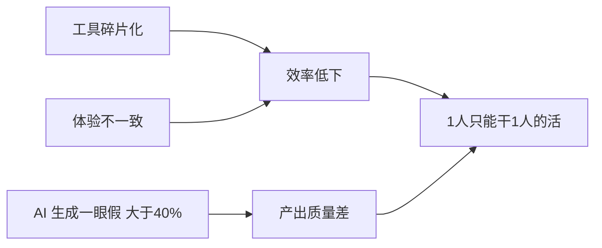

| # | 痛点 | 影响 |
|---|---|---|
| 1 | **工具多乱纷杂** — 各客户项目独立开发工具，无统一平台 | 维护成本高、用户切换成本大、培训成本高 |
| 2 | **用户体验不一** — 不同工具交互逻辑各异 | 标注/创作团队上手慢、效率提升困难 |
| 3 | **"AI 生成一眼假"** — 现有内容生成工具产出 >40% 不合格 post | 返工率高、产出件数/人/日低 |
| 4 | **Prompt 调优困难** — 创作人员反馈无论怎么 finetune prompt，生成图片总显"假" | 创作人员满意度低、信心不足 |

### 2.2 预期价值

- **效率跃迁**：通过工具整合 + AI 辅助，实现 **1000 人完成 3000 人** 的工作量
- **质量提升**：通过 Multi-Agent 系统 + Human-in-the-Loop，将"AI 一眼假"比例从 **>40% 降至 <15%**
- **成本降低**：统一平台减少维护成本，标准化流程降低培训成本

---

## 3. Persona — 用户角色

| 角色 | 人数规模 | 核心诉求 | 日常使用场景 |
|---|---|---|---|
| **标注员** | ~3000 人 | 高效完成标注任务、减少重复操作 | 领取标注任务 → 执行标注 → 提交 |
| **内容创作人员** | ~800 人 | AI 辅助生成高质量 post、减少"AI 假感" | 领取任务 → AI 生成初稿 → Human 修改 → 提交 |
| **质检人员** | ~100 人 | 快速审核 post 质量、高效标记问题 | 领取待审内容 → 逐条质检 → 标记合格/不合格 → 反馈 |
| **项目经理(PM)** | ~100 人 | **从“执行者”升级为“AIGC数据服务管理者”**；48小时内重构标注标准；将甲方视觉语境翻译为执行语言 | 对接头部客户关键词 → 在 **SOP 实验室** 快速建立标准 → 监控 Midjourney/SD 生成调性 |

---

## 4. Scenario — 核心场景与工作流

### 4.1 场景一：多媒体数据标注工作流

> 含敏感数据脱敏处理

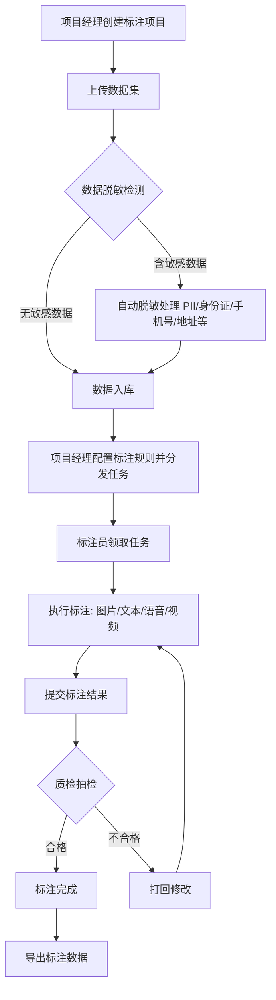

**核心特性：**

- **48h SOP 快速实验室**：
  - PM 可在 48 小时内针对新业务（如 Sora 视频标注、特定艺术风格）建立标准流。
  - 支持直接导入 Midjourney/SD 参考图 and 提示词模板，快速下发小规模测试任务以验证标准可行性。
- **统一标注界面**：图片（框选/分割/关键点）、文本（NER/分类/关系）、语音（转写/情感）、视频（时域标注/目标追踪）共享统一操作范式
- **数据脱敏**：上传数据时自动检测并脱敏 PII 信息（姓名、身份证号、手机号、地址、银行卡等），支持自定义脱敏规则
- **智能任务分发**：根据标注员历史准确率和效率自动推荐分配
- **实时质检**：支持抽检/全检模式，质检结果即时反馈给标注员
- **文生图 (T2I) 提示词优化标注**：
  - **任务类型**：针对 AIGC 提示词的专家级标注。将抽象、模糊的风格描述逐一拆解为可训练的 Token 序列。
  - **核心战场**：将“复古风”标注细化为“胶片质感 + 暖黄滤镜 + 颗粒感”。
  - **产品价值**：沉淀高质量 Prompt 对齐数据，确保 AI 生成结果 **100% 匹配品牌调性**。
- **图生图 (I2I) 风格迁移标注**：
  - **任务类型**：针对风格转换的微观逻辑标注。
  - **核心战场**：标示风格迁移中的构图转换、色彩映射细节（如：从“水墨风”迁移到“赛博朋克”的逻辑转换）。
  - **产品价值**：通过标注数据对齐生成精度，直接**降低 MCN 机构 70% 的返工成本**。

---

## 4.2 场景二：AI 图文内容生成工作流

> 含敏感数据脱敏处理 + AI Prompt Auto-Finetune

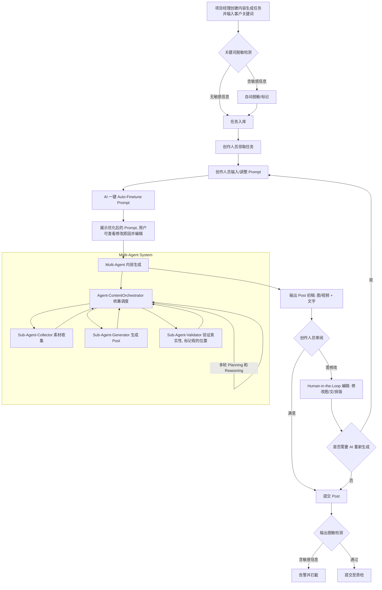

**关键特性：**

- **AI Prompt Auto-Finetune**：
  - 用户输入原始 prompt 后，AI 自动分析并优化 prompt，使生成内容更贴近真实人工创作风格
  - 优化维度：措辞自然度、细节丰富度、风格一致性、避免 AI 典型表达模式
  - 用户可查看 AI 的修改建议和修改原因，并自由编辑优化后的 prompt
  - 支持保存常用 prompt 模板和个人偏好设置

- **Multi-Agent 内容生成系统**（详见第 7 节）

- **"去 AI 假感"策略**：
  - Sub-Agent-Validator 从以下维度评估 post 的真实性：
    - 图片：光影自然度、纹理细节、人物比例、背景一致性、文字/Logo 清晰度
    - 文字：措辞自然度、信息密度、情感表达、口语化程度、是否有 AI 套话
  - 对不合格部分给出**具体标注**和**修改建议**
  - 通过多轮 Agent 迭代自动优化，减少 Human 修改工作量

- **敏感数据脱敏**：输入端和输出端双重脱敏检测

---

### 4.3 场景三：AIGC 品牌调性质检与手术刀式反馈
> 针对 MCN 机构返工痛点，实现 100% 品牌调性还原

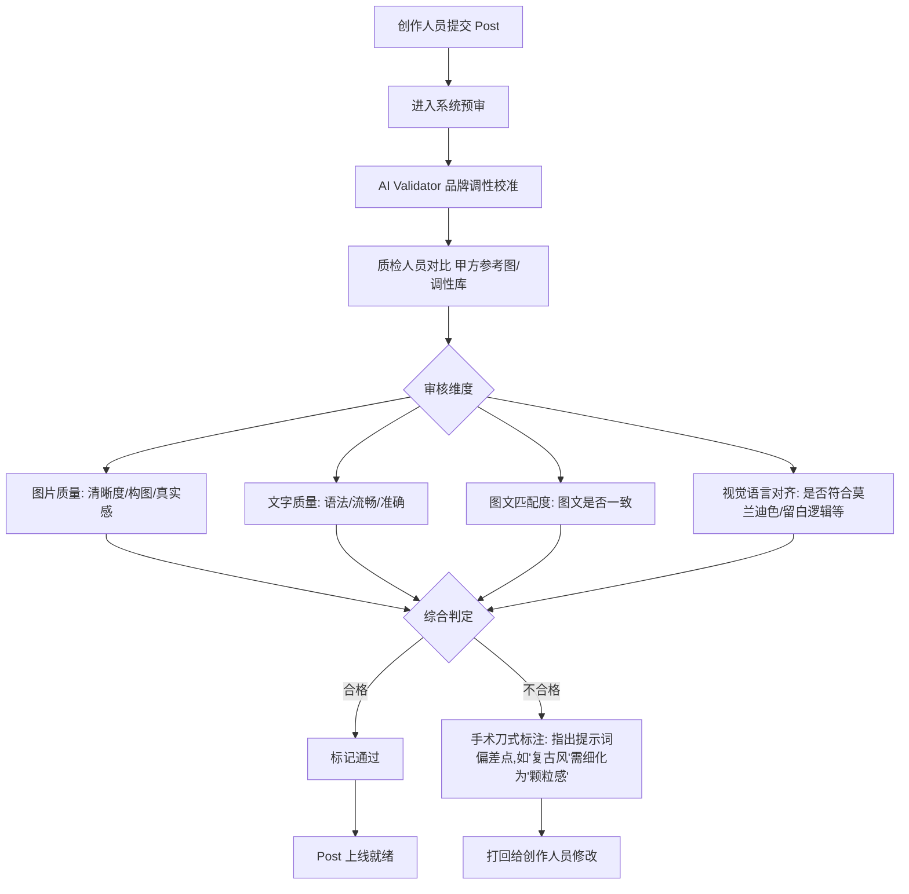

**关键特性：**

- **手术刀式提示词标注 (Prompt Surgical Annotation)**：
  - 质检反馈不再停留于“好/坏”，而是精准标注样式偏差。
  - **示例**：将模糊的“复古感”标注细化为“胶片感”、“颗粒度”、“90年代低像素”等具体技术参数。
- **品牌调性校准模块 (Brand Tone-of-Voice Calibration)**：
  - 在质检中增加“莫兰迪色系”、“极简构图”、“品牌语气”等抽象调性的自动比对逻辑。
- **AI 辅助预审**：集成 AI 辅助检测，自动预标记疑似"一眼假"元素。
- **绩效闭环**：质检结果与创作人员绩效挂钩，质检意见模板化。

---

### 4.4 场景四：工作量统计工作流

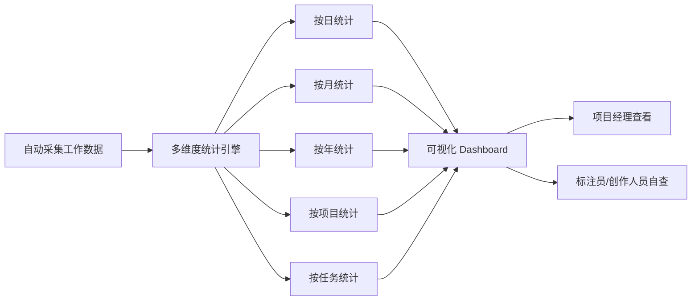

**统计维度：**

| 维度 | 标注员指标 | 内容创作人员指标 |
|---|---|---|
| **产出** | 合格标注件数/人/日 | 合格 post 件数/人/日 |
| **质量** | 标注准确率 | Post 一次通过率 |
| **效率** | 平均单条标注耗时 | 平均单条 post 创作耗时 |
| **趋势** | 日/周/月产出趋势图 | 日/周/月产出趋势图 |

---

## 5. Success Metrics — 成功指标

| 指标 | 目标说明 | 目标值(v1.0) |
|---|---|---|
| **SOP 响应速度** | 针对新项目(如新风格)的标注标准重构耗时 | **< 48 小时** |
| **品牌调性匹配度** | 甲方反馈生成内容符合“高级感/品牌调性”的比例 | **100%** |
| **MCN 返工减少率** | 相比传统流程减少的反复修改工作量 | **> 70%** |
| **Post "AI 一眼假"率** | 质检判定为“人类真实感”内容的提升比例 | **< 10%** |
| **合格产出件数/人/日** | 全流程效率提升比例 | **+80%** |

---

## 6. Trade-off — 设计取舍

| 决策 | 选择 | 理由 |
|---|---|---|
| **IAM 权限管理** | ❌ 不做严格 IAM | 内部平台，优先用户体验和开发速度；采用轻量级角色划分（标注员/创作人员/质检/PM），不做细粒度权限控制 |
| **多租户隔离** | ❌ 暂不支持 | 内部单一组织使用，按项目隔离即可 |
| **自建 AI 模型** | ❌ 暂不自建 | 优先整合现有在用的第三方模型/工具（**Midjourney** / **Stable Diffusion** / Sora / Banana / Canva 等），后续按需提供精准的标注与微调服务 |
| **移动端支持** | ❌ 暂不支持 | 标注和内容创作以桌面端为主场景 |

---

## 7. High-Level Solution — 技术方案

### 7.1 整体架构

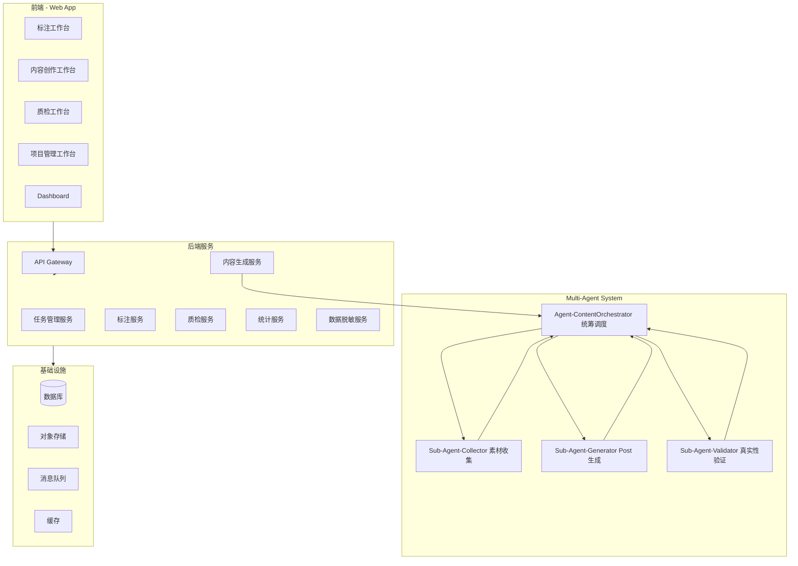

### 7.2 Multi-Agent 内容生成系统

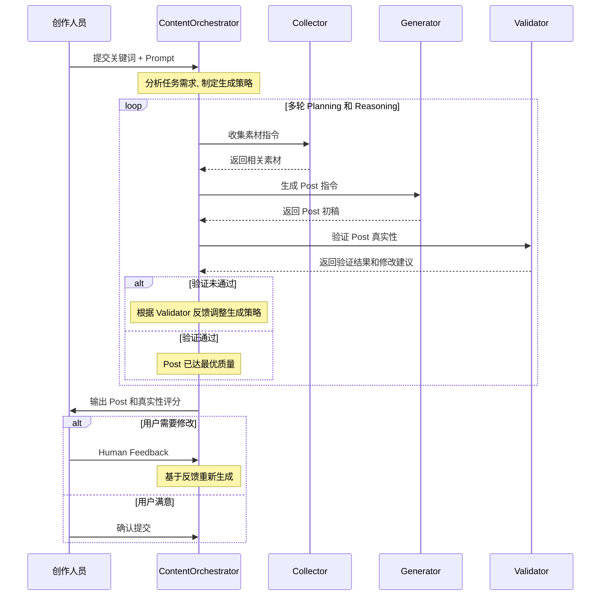

**各 Agent 职责详述：**

#### Agent-ContentOrchestrator（总调度）
- **职责**：统筹图文生成的全流程，管理三个 Sub-Agent 的协作
- **核心能力**：
  - 任务理解与分解：解析用户输入的关键词 and prompt，制定生成策略
  - 多轮迭代决策：根据 Validator 反馈判断是否需要重新生成
  - 最优输出判断：综合评估生成 post 的质量，决定何时向用户展示结果
  - Human Feedback 处理：接收用户修改意见并转化为 Agent 指令

#### Sub-Agent-Collector（素材收集）
- **职责**：基于关键词 and 用户意图收集相关参考素材
- **数据来源**：内部素材库、公开资源、风格参考库
- **输出**：参考图片/视频、文案风格样本、色调/排版参考

#### Sub-Agent-Generator（内容生成）
- **职责**：基于素材 and 优化后的 prompt 生成 post 内容
- **生成内容**：图片/视频（调用图像生成模型）、文字描述、排版建议
- **AIGC 工具对接**：
    - 深度集成 **Midjourney** 与 **Stable Diffusion** 生态：支持 LoRA、ControlNet、Checkpoints 的精细化参数控制
    - 支持 **ComfyUI 工作流** 管理，将复杂的图生图管线转化为可复用的标注模板
- **"去假"策略**：
  - 融入参考素材的风格特征
  - 避免 AI 典型的"过度完美"和"不自然光影"
  - 文案采用口语化、信息密度适中的表达方式

#### Sub-Agent-Validator（真实性验证）
- **职责**：评估生成 post 的人类真实性，识别"AI 一眼假"元素
- **检测维度**：

| 检测类别 | 检测项 |
|---|---|
| **图片真实性** | 光影自然度、纹理/细节、人物比例/手部、背景连贯性、文字/Logo 渲染 |
| **文字真实性** | 措辞自然度、是否有 AI 套话/半句、口语化程度、信息密度 |
| **整体一致性** | 图文匹配度、风格统一性、排版合理性 |

- **输出**：真实性评分（0-100）+ 不合格元素具体位置标注 + 修改建议

---

### 7.3 AI Prompt Auto-Finetune 模块

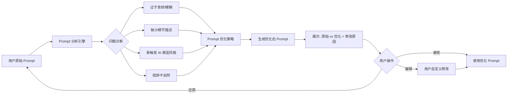

**优化策略包括：**
1. **细节增强**：补充场景细节、材质描述、光线氛围等
2. **风格锚定**：添加真实摄影/设计风格参考（如"iPhone 随手拍风格""杂志排版风格"）
3. **反 AI 模式**：规避容易触发 AI 典型输出的表达（如过于工整的构图、不自然的完美肤质）
4. **个性化学习**：记录用户历史修改偏好，逐步学习个人风格

---

## 8. 敏感数据脱敏方案

### 8.1 脱敏范围

| 数据类型 | 示例 | 脱敏方式 |
|---|---|---|
| 姓名 | 张三 → 张** | 部分遮蔽 |
| 身份证号 | 110105199001011234 → 110105\*\*\*\*\*\*1234 | 中间遮蔽 |
| 手机号 | 13800138000 → 138\*\*\*\*8000 | 中间遮蔽 |
| 银行卡号 | 6222021234561234567 → 6222\*\*\*\*\*\*\*4567 | 中间遮蔽 |
| 地址 | 具体地址 → 省/市级 | 精度降低 |
| 人脸 | 图片中的人脸 | 自动模糊/马赛克 |

### 8.2 脱敏时机
- **输入端**：数据上传/导入时自动检测并脱敏
- **过程中**：标注/创作过程中实时监控
- **输出端**：Post 提交前最终脱敏检查

---

## 9. High-Level Schedule / Roadmap

| 版本 | 里程碑 | 时间窗口 | 交付周期 | 核心交付物 |
|---|---|---|---|---|
| **v0.1** | 内容生成 MVP | T0 ~ T0+3M | 3 个月 | Multi-Agent 内容生成系统、Prompt Auto-Finetune、创作工作台、Human-in-the-Loop 编辑 |
| **v0.2** | 多媒体标注 MVP | T0+3M ~ T0+6M | 3 个月 | 图/文/音/视频标注引擎、标注工作台、任务分发 |
| **v0.3** | 数据合规 | T0+6M ~ T0+9M | 3 个月 | 输入/输出端脱敏检测、合规审计日志、敏感数据监控 |
| **v0.4** | 版权素材库接入 | T0+9M ~ T0+10M | 1 个月 | 接入 Stock 素材库，进一步改善"一眼假"问题 |
| **v0.5** | RLHF | T0+10M ~ T0+11M | 1 个月 | 多源 Human Signal 接入 RLHF pipeline，持续优化生成模型 |
| **v0.6** | 闭环 Finetune | T0+11M ~ T0+13M | 2 个月 | 打通标注数据与内容生成的数据通道，实现基座模型闭环 finetune 和 evaluation |
| **v0.7** | Dashboard | T0+13M ~ T0+14M | 1 个月 | 任务完成时长及 breakdown、任务数/类型、注册/DAU/MAU、任务数/用户 |

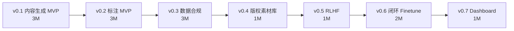

---

## 10. 各版本详细说明

> v0.1（内容生成 MVP）和 v0.2（标注 MVP）的详细设计见第 4、7 节。以下补充 v0.3 ~ v0.6 的详细说明。

### 10.1 v0.3 — 数据合规需求支持

**目标**：为标注 and 内容生成两条业务线提供完整的敏感数据合规能力，确保数据全生命周期安全可控。

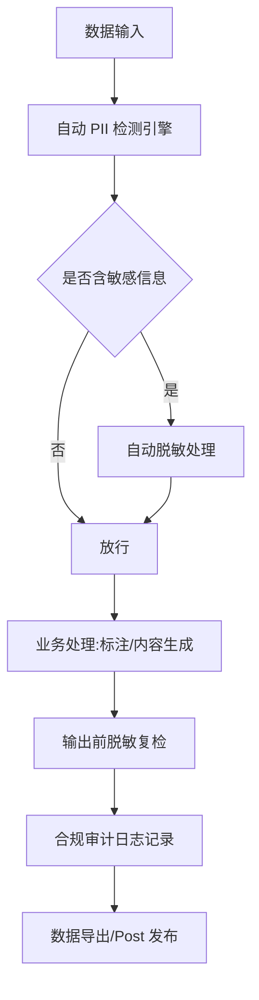

**核心功能：**

| 功能模块 | 说明 |
|---|---|
| **PII 自动检测引擎** | 支持中英文姓名、身份证、手机号、银行卡、地址、人脸等多类型 PII 识别，支持自定义规则扩展 |
| **多策略脱敏** | 遮蔽、替换、泛化、加噪等多种脱敏策略，按数据类型自动匹配 |
| **双端检测** | 数据输入端 + 输出端双重脱敏检测，防止脱敏遗漏 |
| **过程监控** | 标注/创作过程中实时扫描用户输入内容，发现敏感信息即时告警 |
| **合规审计日志** | 记录所有脱敏操作（操作人、时间、脱敏前后摘要），支持审计导出 |
| **权限隔离** | 脱敏后数据与原始数据物理隔离，标注员/创作人员仅可访问脱敏后数据 |

---

### 10.2 v0.4 — 接入版权素材库（Stock）

**目标**：接入正版商业素材库，为 Sub-Agent-Collector 提供高质量真实素材源，从源头改善"AI 一眼假"问题。

**核心功能：**

| 功能模块 | 说明 |
|---|---|
| **Stock API 集成** | 对接 Shutterstock / Getty Images 等主流版权素材库 API，支持关键词搜索、风格筛选、授权管理 |
| **素材智能推荐** | Sub-Agent-Collector 自动根据用户关键词 and prompt 语义匹配最相关的 Stock 素材作为参考 |
| **风格融合** | Sub-Agent-Generator 将 Stock 真实素材的光影、纹理、构图特征融入生成结果，降低 AI 痕迹 |
| **版权合规** | 自动记录素材使用来源 and 授权信息，确保输出内容版权合规 |
| **素材缓存** | 高频使用素材本地缓存，降低 API 调用成本 and 延迟 |

**对"去假"的提升路径：**
- 以真实 Stock 素材作为风格锚点 → AI 生成结果更贴近真实摄影/设计
- 支持"基于真实图片局部编辑"模式 → 保留真实感，仅在需要的部分进行 AI 生成

---

### 10.3 v0.5 — 多源 Human Signal 接入 RLHF

**目标**：将平台中产生的三类 Human Signal 系统化地接入 RLHF（Reinforcement Learning from Human Feedback）pipeline，持续优化内容生成模型质量。

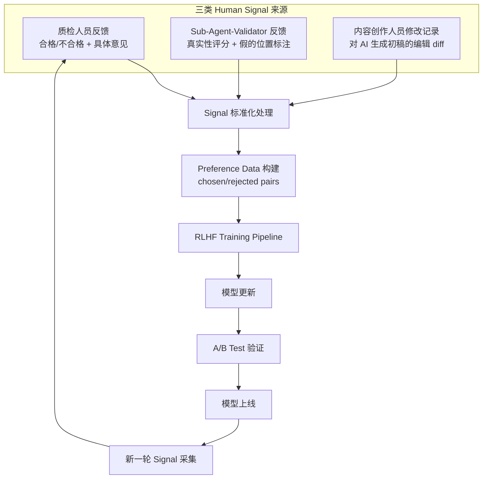

**三类 Human Signal 详述：**

| Signal 来源 | 数据内容 | 信号强度 | 采集方式 |
|---|---|---|---|
| **质检人员反馈** | 合格/不合格判定 + 不合格原因（图片假感、文字套话、图文不匹配等） | 强信号（显式判定） | 质检流程中自动采集 |
| **Sub-Agent-Validator 反馈** | 真实性评分（0-100）、不合格元素位置标注、修改建议 | 中强信号（AI 评估） | Agent 系统自动记录 |
| **创作人员修改记录** | AI 生成初稿 vs 创作人员最终提交版本的 diff（文字修改、图片替换/编辑记录） | 中信号（隐式偏好） | 系统自动 diff 采集 |

**RLHF Pipeline 设计要点：**

1. **Preference Data 构建**
   - 质检通过的 post 做为 chosen，质检打回的 post 作为 rejected
   - 创作人员修改前的 AI 初稿作为 rejected，修改后的终稿作为 chosen
   - Validator 评分高的生成结果 vs 评分低的结果构成 preference pair

2. **增量训练**
   - 按周/月批次收集 signal，增量训练 reward model
   - 支持针对特定"假感"类型（人物手部、光影、文字套话等） the 定向优化

3. **效果评估**
   - A/B Test：新模型生成 vs 旧模型生成，由质检人员盲审打分
   - 核心指标：质检一次通过率环比提升、"AI 一眼假"率下降

---

### 10.4 v0.6 — 标注-生成闭环 Finetune

**目标**：打通标注业务 and 内容生成业务的数据通道，利用标注产出的高质量数据对基座模型进行闭环 finetune，并建立系统化的 evaluation 体系。

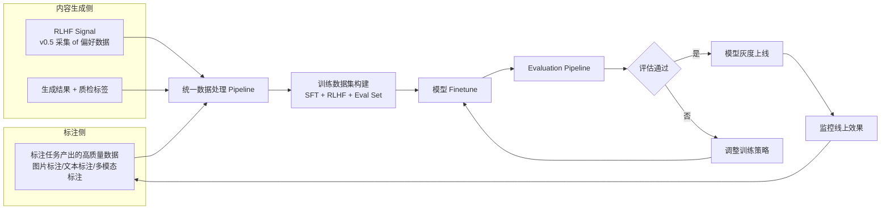

**核心功能：**

| 功能模块 | 说明 |
|---|---|
| **数据通道** | 标注侧高质量标注数据 (如图像描述、多模态对齐数据) 自动流转至生成侧训练集 |
| **训练集管理** | 统一管理 SFT 数据集、RLHF 偏好数据集、Evaluation 测试集，支持版本化 and 可追溯 |
| **Finetune Pipeline** | 支持 LoRA / Full Finetune 等策略，集成训练任务调度 and GPU 资源管理 |
| **Evaluation 体系** | 自动化评估 pipeline：多维度评分 (真实性/创意性/图文匹配度) + 人工抽检 |
| **模型版本管理** | 模型 checkpoints 版本化管理，支持灰度发布 and 一键回滚 |

**闭环价值**：标注数据质量提升 $\rightarrow$ 模型 finetune 效果提升 $\rightarrow$ 生成质量提升 $\rightarrow$ 更多高质量生成数据反哺标注 and 训练，形成**数据飞轮**。

---

## 11. 风险与缓解

| 风险 | 影响 | 缓解措施 |
|---|---|---|
| AI 模型生成质量 not 达预期 | Post "一眼假"率无法有效降低 | Multi-Agent 多轮验证 + RLHF 持续优化 + 版权素材库兜底 |
| 用户迁移阻力 | 标注员习惯旧工具，不愿切换 | 分批灰度上线 + 保留过渡期 + 用户培训 |
| 数据安全合规 | 脱敏不完整导致数据泄露 | 双重脱敏检测 (输入+输出) + 定期审计 |
| 第三方 API 依赖 | 模型服务不稳定/变更 | 多模型 fallback 策略 + 抽象适配层 |
| RLHF Signal 质量不均 | 低质量 signal 导致模型退化 | 多源 signal 交叉验证 + signal 质量过滤 + A/B Test 上线前验证 |
| 闭环数据偏差 | 模型越训越偏向特定风格 | Evaluation 测试集多样性保障 + 定期引入外部数据校准 |

---

## 12. 附录

### 12.1 术语表

| 术语 | 说明 |
|---|---|
| **Post** | 社交媒体发布内容，包含图/视频 + 文字介绍 |
| **"AI 一眼假"** | 生成内容明显呈现 AI 生成特征，一眼就能看出非人工创作 |
| **Human-in-the-Loop** | 在 AI 生成流程中引入人工审核 and 修改环节 |
| **RLHF** | Reinforcement Learning from Human Feedback，基于人类反馈的强化学习 |
| **PII** | Personally Identifiable Information，个人可识别信息 |
| **Multi-Agent** | 多智能体系统，多个 AI Agent 协作完成复杂任务 |
| **Prompt Auto-Finetune** | AI 自动优化用户输入的 prompt，提升生成内容质量 |
| **Stock** | 正版商业素材库 (如 Shutterstock、Getty Images) |
| **SFT** | Supervised Fine-Tuning，监督微调 |
| **LoRA** | Low-Rank Adaptation，低秩自适应微调方法 |
| **Preference Data** | 偏好数据, 包含 chosen/rejected 配对样本, 用于 RLHF 训练 |
