<h1 align="center">OmniDataFlow Product Requirements Document (PRD)</h1>

2026-03, wukun2005@gmail.com

---

## 0. Product Demo

[OmniDataFlow Demo Video](https://1drv.ms/v/c/203d7a34c28a5187/IQBq3_JUGkXCQrhmnIIWUB-kAQPtbCt4OeQWnMNPFfeN87I?e=b2nBXj)

---

## 1. What — Product Definition

**OmniDataFlow** is a **one-stop data annotation and content generation platform** designed for internal teams. It integrates existing fragmented annotation tools and content creation tools, unifying multimedia data annotation (image/text/audio/video) with AI-driven image-text content generation (Human-in-the-Loop) into a single platform.

> **OneTool · OneTeam** — Enable 1,000 people to do the work of 3,000.

### 1.1 Core Capabilities

| Capability | Description |
|---|---|
| **Multimedia Data Annotation** | Standardized annotation workflows for image, text, audio, and video data |
| **AI Image-Text Content Generation** | Automatically generate social media posts (image/video + text) based on client keywords using a Multi-Agent system |
| **Prompt Intelligent Optimization** | AI one-click auto-finetune user prompts to reduce the "obviously AI-generated" ratio |
| **Quality Inspection Workflow** | Built-in post quality inspection process for systematic screening of substandard content |
| **Workload Statistics** | Multi-dimensional (daily/monthly/yearly/project/task) output statistics for annotators and content creators |
| **Sensitive Data Anonymization** | Built-in data anonymization capability in annotation and content generation workflows |

---

## 2. Why — Motivation and Background

### 2.1 Current Pain Points

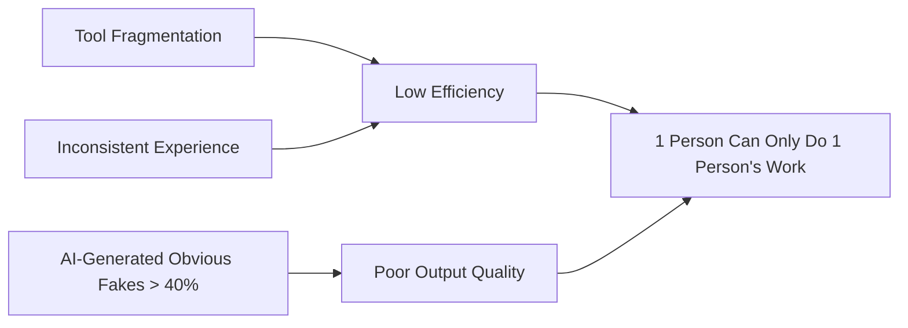

| # | Pain Point | Impact |
|---|---|---|
| 1 | **Chaotic Tool Landscape** — Each client project develops its own tools independently, with no unified platform | High maintenance costs, high user switching costs, high training costs |
| 2 | **Inconsistent User Experience** — Different tools have varying interaction logic | Slow onboarding for annotation/creation teams, difficulty improving efficiency |
| 3 | **"AI-Generated Obvious Fakes"** — Existing content generation tools produce >40% substandard posts | High rework rate, low output pieces/person/day |
| 4 | **Difficult Prompt Tuning** — Content creators report that no matter how they finetune prompts, generated images always look "fake" | Low creator satisfaction, lack of confidence |

### 2.2 Expected Value

- **Efficiency Leap**: Through tool integration + AI assistance, achieve **1,000 people completing the work of 3,000**
- **Quality Improvement**: Through Multi-Agent system + Human-in-the-Loop, reduce the "AI obvious fake" ratio from **>40% to <15%**
- **Cost Reduction**: Unified platform reduces maintenance costs; standardized workflows reduce training costs

---

## 3. Persona — User Roles

| Role | Scale | Core Needs | Daily Usage Scenarios |
|---|---|---|---|
| **Annotator** | ~3,000 | Complete annotation tasks efficiently, reduce repetitive operations | Receive annotation task → Execute annotation → Submit |
| **Content Creator** | ~800 | AI-assisted generation of high-quality posts, reduce "AI fakeness" | Receive task → AI generates draft → Human edits → Submit |
| **QC Inspector** | ~100 | Quickly review post quality, efficiently flag issues | Receive content for review → Inspect item by item → Mark pass/fail → Provide feedback |
| **Project Manager (PM)** | ~100 | **Upgrade from "executor" to "AIGC data service manager"**; reconstruct annotation standards within 48 hours; translate client visual context into execution language | Connect with top-tier client keywords → Rapidly establish standards in the **SOP Laboratory** → Monitor Midjourney/SD generation tone |

---

## 4. Scenario — Core Scenarios and Workflows

### 4.1 Scenario 1: Multimedia Data Annotation Workflow

> Includes sensitive data anonymization processing

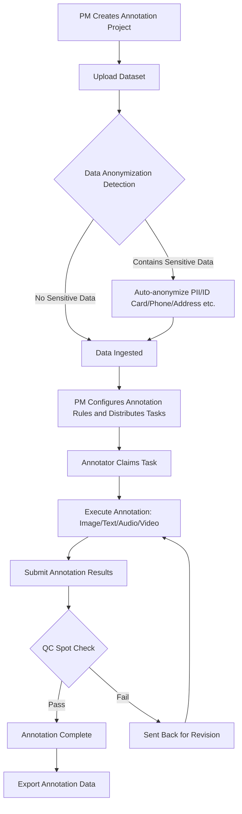

**Core Features:**

- **48h SOP Rapid Laboratory**:
  - PMs can establish standard workflows for new business (e.g., Sora video annotation, specific art styles) within 48 hours.
  - Supports direct import of Midjourney/SD reference images and prompt templates, quickly dispatching small-scale test tasks to validate standard feasibility.
- **Unified Annotation Interface**: Image (bounding box/segmentation/keypoint), text (NER/classification/relation), audio (transcription/sentiment), video (temporal annotation/object tracking) share a unified operational paradigm.
- **Data Anonymization**: Automatic detection and anonymization of PII information (name, ID number, phone number, address, bank card, etc.) upon data upload, with support for custom anonymization rules.
- **Smart Task Distribution**: Automatic recommended assignment based on annotator historical accuracy and efficiency.
- **Real-time Quality Inspection**: Supports spot-check/full-check modes with instant feedback to annotators.
- **Text-to-Image (T2I) Prompt Optimization Annotation**:
  - **Task Type**: Expert-level annotation for AIGC prompts. Deconstructs abstract, vague style descriptions into trainable token sequences.
  - **Core Battlefield**: Annotating "retro style" into granular details like "film texture + warm yellow filter + graininess".
  - **Product Value**: Accumulates high-quality prompt alignment data to ensure AI-generated results **100% match brand tone**.
- **Image-to-Image (I2I) Style Transfer Annotation**:
  - **Task Type**: Micro-level logic annotation for style transfer.
  - **Core Battlefield**: Annotating composition transformation and color mapping details in style transfer (e.g., the logical transformation from "ink painting style" to "cyberpunk").
  - **Product Value**: Aligns generation precision through annotation data, directly **reducing MCN agency rework costs by 70%**.

---

## 4.2 Scenario 2: AI Image-Text Content Generation Workflow

> Includes sensitive data anonymization + AI Prompt Auto-Finetune

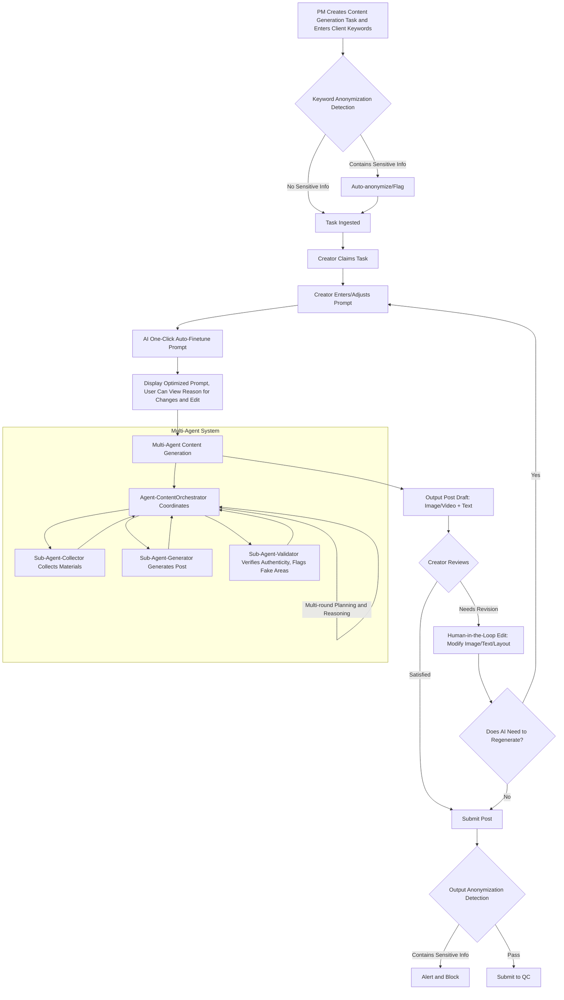

**Key Features:**

- **AI Prompt Auto-Finetune**:
  - After the user enters the original prompt, AI automatically analyzes and optimizes it to make generated content closer to authentic human creation style.
  - Optimization dimensions: phrasing naturalness, detail richness, style consistency, avoidance of typical AI expression patterns.
  - Users can view AI's modification suggestions and reasons, and freely edit the optimized prompt.
  - Supports saving frequently used prompt templates and personal preference settings.

- **Multi-Agent Content Generation System** (see Section 7 for details)

- **"De-AI-Fakeness" Strategy**:
  - Sub-Agent-Validator evaluates post authenticity from the following dimensions:
    - Image: light and shadow naturalness, texture details, human proportions, background consistency, text/logo clarity
    - Text: phrasing naturalness, information density, emotional expression, colloquialism level, presence of AI boilerplate
  - Provides **specific annotations** and **revision suggestions** for substandard parts.
  - Through multi-round Agent iteration and automatic optimization, reduces human modification workload.

- **Sensitive Data Anonymization**: Dual anonymization detection at both input and output ends.

---

### 4.3 Scenario 3: AIGC Brand Tone QC and Surgical Feedback
> Addresses MCN agency rework pain points, achieving 100% brand tone restoration

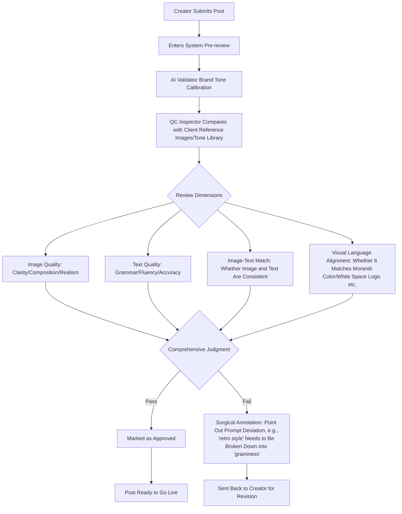

**Key Features:**

- **Surgical Prompt Annotation (Prompt Surgical Annotation)**:
  - QC feedback goes beyond "good/bad" to precisely annotate style deviations.
  - **Example**: Annotating vague "retro feel" into specific technical parameters like "film texture," "graininess," "90s low resolution."
- **Brand Tone-of-Voice Calibration Module**:
  - Adds automatic comparison logic for abstract tones like "Morandi color palette," "minimalist composition," and "brand voice" in QC.
- **AI-Assisted Pre-review**: Integrates AI-assisted detection to automatically pre-flag suspected "obviously AI-generated" elements.
- **Performance Closed Loop**: QC results linked to creator performance; QC feedback templates standardized.

---

### 4.4 Scenario 4: Workload Statistics Workflow

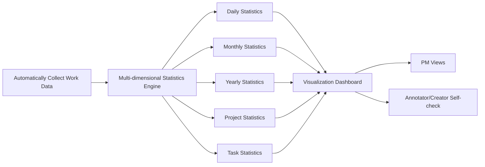

**Statistics Dimensions:**

| Dimension | Annotator Metrics | Content Creator Metrics |
|---|---|---|
| **Output** | Qualified annotation pieces/person/day | Qualified post pieces/person/day |
| **Quality** | Annotation accuracy rate | Post first-pass rate |
| **Efficiency** | Average time per annotation | Average time per post creation |
| **Trend** | Daily/weekly/monthly output trend chart | Daily/weekly/monthly output trend chart |

---

## 5. Success Metrics

| Metric | Target Description | Target Value (v1.0) |
|---|---|---|
| **SOP Response Speed** | Time to reconstruct annotation standards for new projects (e.g., new styles) | **< 48 hours** |
| **Brand Tone Match Rate** | Client feedback on content matching "premium feel/brand tone" | **100%** |
| **MCN Rework Reduction Rate** | Reduction in repetitive modification work compared to traditional workflows | **> 70%** |
| **Post "AI Obvious Fake" Rate** | Improvement ratio of content judged as "authentic human feel" by QC | **< 10%** |
| **Qualified Output Pieces/Person/Day** | Full workflow efficiency improvement ratio | **+80%** |

---

## 6. Trade-off — Design Decisions

| Decision | Choice | Rationale |
|---|---|---|
| **IAM Permission Management** | ❌ No Strict IAM | Internal platform prioritizing user experience and development speed; lightweight role-based access (annotator/creator/QC/PM) without fine-grained permission control |
| **Multi-tenant Isolation** | ❌ Not Supported Yet | Single internal organization; project-level isolation is sufficient |
| **Custom AI Models** | ❌ Not Building Yet | Prioritize integration with existing third-party models/tools (**Midjourney** / **Stable Diffusion** / Sora / Banana / Canva etc.); provide precise annotation and finetuning services as needed later |
| **Mobile Support** | ❌ Not Supported Yet | Annotation and content creation primarily desktop-based scenarios |

---

## 7. High-Level Solution — Technical Architecture

### 7.1 Overall Architecture

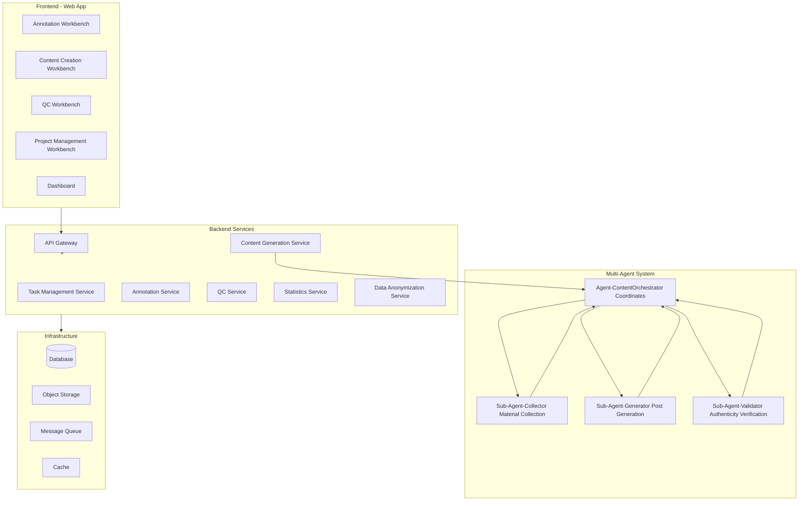

### 7.2 Multi-Agent Content Generation System

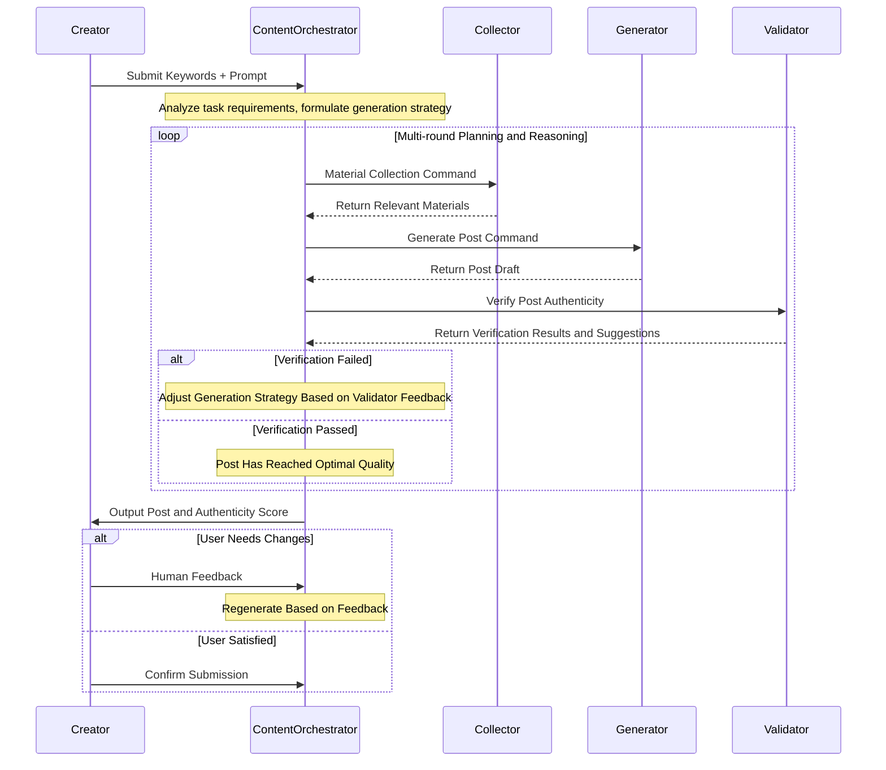

**Detailed Agent Responsibilities:**

#### Agent-ContentOrchestrator (Master Coordinator)
- **Responsibility**: Orchestrate the entire image-text generation workflow, managing collaboration among three Sub-Agents.
- **Core Capabilities**:
  - Task understanding and decomposition: Parse user-input keywords and prompts, formulate generation strategy.
  - Multi-round iterative decision-making: Determine whether regeneration is needed based on Validator feedback.
  - Optimal output judgment: Comprehensively evaluate generated post quality, decide when to present results to users.
  - Human Feedback processing: Receive user modification suggestions and convert them into Agent commands.

#### Sub-Agent-Collector (Material Collection)
- **Responsibility**: Collect relevant reference materials based on keywords and user intent.
- **Data Sources**: Internal material library, public resources, style reference library.
- **Output**: Reference images/videos, copywriting style samples, color/layout references.

#### Sub-Agent-Generator (Content Generation)
- **Responsibility**: Generate post content based on materials and optimized prompts.
- **Generated Content**: Images/videos (via image generation models), text descriptions, layout suggestions.
- **AIGC Tool Integration**:
    - Deep integration with **Midjourney** and **Stable Diffusion** ecosystems: Fine-grained parameter control for LoRA, ControlNet, Checkpoints.
    - Supports **ComfyUI workflow** management, converting complex image-to-image pipelines into reusable annotation templates.
- **"De-Fakeness" Strategy**:
  - Incorporate style characteristics from reference materials.
  - Avoid typical AI "over-perfection" and "unnatural lighting."
  - Use colloquial, moderately information-dense copywriting.

#### Sub-Agent-Validator (Authenticity Verification)
- **Responsibility**: Evaluate the human authenticity of generated posts, identify "obviously AI-generated" elements.
- **Detection Dimensions**:

| Detection Category | Detection Items |
|---|---|
| **Image Authenticity** | Light and shadow naturalness, texture/details, human proportions/hands, background coherence, text/logo rendering |
| **Text Authenticity** | Phrasing naturalness, presence of AI boilerplate/half-sentences, colloquialism level, information density |
| **Overall Consistency** | Image-text match, style consistency, layout reasonableness |

- **Output**: Authenticity score (0-100) + specific location annotation for substandard elements + revision suggestions

---

### 7.3 AI Prompt Auto-Finetune Module

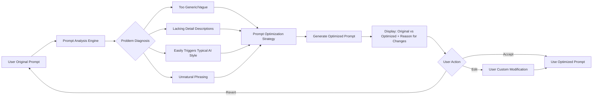

**Optimization Strategies Include:**
1. **Detail Enhancement**: Supplement scene details, material descriptions, lighting atmosphere, etc.
2. **Style Anchoring**: Add real photography/design style references (e.g., "iPhone casual shot style," "magazine layout style").
3. **Anti-AI Pattern**: Avoid expressions that easily trigger typical AI output (e.g., overly perfect composition, unnaturally flawless skin).
4. **Personalized Learning**: Record user historical modification preferences, gradually learn individual style.

---

## 8. Sensitive Data Anonymization Scheme

### 8.1 Anonymization Scope

| Data Type | Example | Anonymization Method |
|---|---|---|
| Name | Zhang San → Zhang** | Partial masking |
| ID Card Number | 110105199001011234 → 110105\*\*\*\*\*\*1234 | Middle masking |
| Phone Number | 13800138000 → 138\*\*\*\*8000 | Middle masking |
| Bank Card Number | 6222021234561234567 → 6222\*\*\*\*\*\*\*4567 | Middle masking |
| Address | Specific address → Province/City level | Precision reduction |
| Face | Faces in images | Auto-blur/mosaic |

### 8.2 Anonymization Timing
- **Input End**: Automatic detection and anonymization during data upload/import.
- **During Processing**: Real-time monitoring during annotation/creation process.
- **Output End**: Final anonymization check before post submission.

---

## 9. High-Level Schedule / Roadmap

| Version | Milestone | Time Window | Delivery Period | Core Deliverables |
|---|---|---|---|---|
| **v0.1** | Content Generation MVP | T0 ~ T0+3M | 3 months | Multi-Agent content generation system, Prompt Auto-Finetune, Creation Workbench, Human-in-the-Loop editing |
| **v0.2** | Multimedia Annotation MVP | T0+3M ~ T0+6M | 3 months | Image/text/audio/video annotation engine, Annotation Workbench, Task Distribution |
| **v0.3** | Data Compliance | T0+6M ~ T0+9M | 3 months | Input/output anonymization detection, compliance audit logs, sensitive data monitoring |
| **v0.4** | Licensed Stock Library Integration | T0+9M ~ T0+10M | 1 month | Stock library integration to further improve the "obviously AI-generated" issue |
| **v0.5** | RLHF | T0+10M ~ T0+11M | 1 month | Multi-source Human Signal integration into RLHF pipeline, continuous generation model optimization |
| **v0.6** | Closed-loop Finetune | T0+11M ~ T0+13M | 2 months | Connect annotation data and content generation data channels, achieving base model closed-loop finetune and evaluation |
| **v0.7** | Dashboard | T0+13M ~ T0+14M | 1 month | Task completion duration and breakdown, task count/type, registered/DAU/MAU, tasks/user |

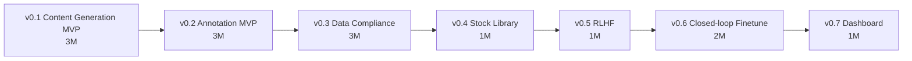

---

## 10. Detailed Version Descriptions

> For detailed design of v0.1 (Content Generation MVP) and v0.2 (Annotation MVP), see Sections 4 and 7. The following supplements v0.3 ~ v0.6 detailed descriptions.

### 10.1 v0.3 — Data Compliance Requirements Support

**Goal**: Provide complete sensitive data compliance capabilities for both annotation and content generation business lines, ensuring data is secure and controllable throughout its lifecycle.

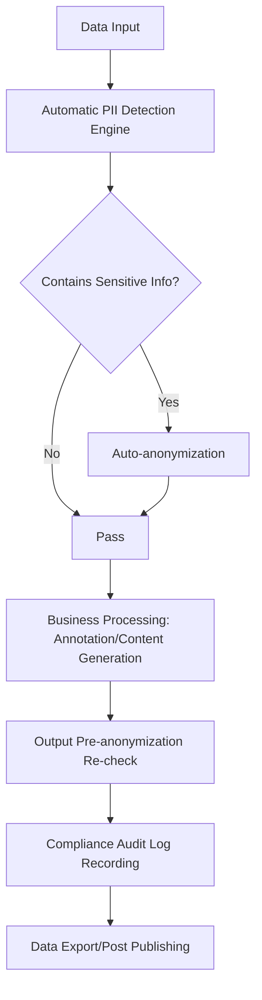

**Core Features:**

| Feature Module | Description |
|---|---|
| **PII Auto-detection Engine** | Supports multi-type PII recognition including Chinese/English names, ID cards, phone numbers, bank cards, addresses, faces, etc.; supports custom rule extensions |
| **Multi-strategy Anonymization** | Multiple anonymization strategies including masking, replacement, generalization, noise addition, automatically matched by data type |
| **Dual-end Detection** | Data input end + output end dual anonymization detection to prevent anonymization omissions |
| **Process Monitoring** | Real-time scanning of user input content during annotation/creation, instant alerts for sensitive information |
| **Compliance Audit Logs** | Records all anonymization operations (operator, time, before/after anonymization summary), supports audit export |
| **Permission Isolation** | Anonymized data physically isolated from original data; annotators/creators can only access anonymized data |

---

### 10.2 v0.4 — Licensed Stock Library Integration

**Goal**: Integrate legitimate commercial stock libraries to provide high-quality authentic material sources for Sub-Agent-Collector, improving the "obviously AI-generated" issue from the source.

**Core Features:**

| Feature Module | Description |
|---|---|
| **Stock API Integration** | Connect with mainstream licensed stock library APIs (Shutterstock / Getty Images etc.), supporting keyword search, style filtering, license management |
| **Smart Material Recommendation** | Sub-Agent-Collector automatically matches the most relevant Stock materials based on user keywords and prompt semantics |
| **Style Fusion** | Sub-Agent-Generator incorporates light/shadow, texture, and composition characteristics from real Stock materials into generated results to reduce AI traces |
| **Copyright Compliance** | Automatically records material usage sources and license information to ensure output content copyright compliance |
| **Material Caching** | Local caching of frequently used materials to reduce API call costs and latency |

**Improvement Path for "De-Fakeness":**
- Use real Stock materials as style anchors → AI generation results closer to authentic photography/design
- Support "partial editing based on real images" mode → Preserve authenticity, only perform AI generation where needed

---

### 10.3 v0.5 — Multi-source Human Signal Integration into RLHF

**Goal**: Systematically integrate three types of Human Signals generated on the platform into the RLHF (Reinforcement Learning from Human Feedback) pipeline, continuously optimizing content generation model quality.

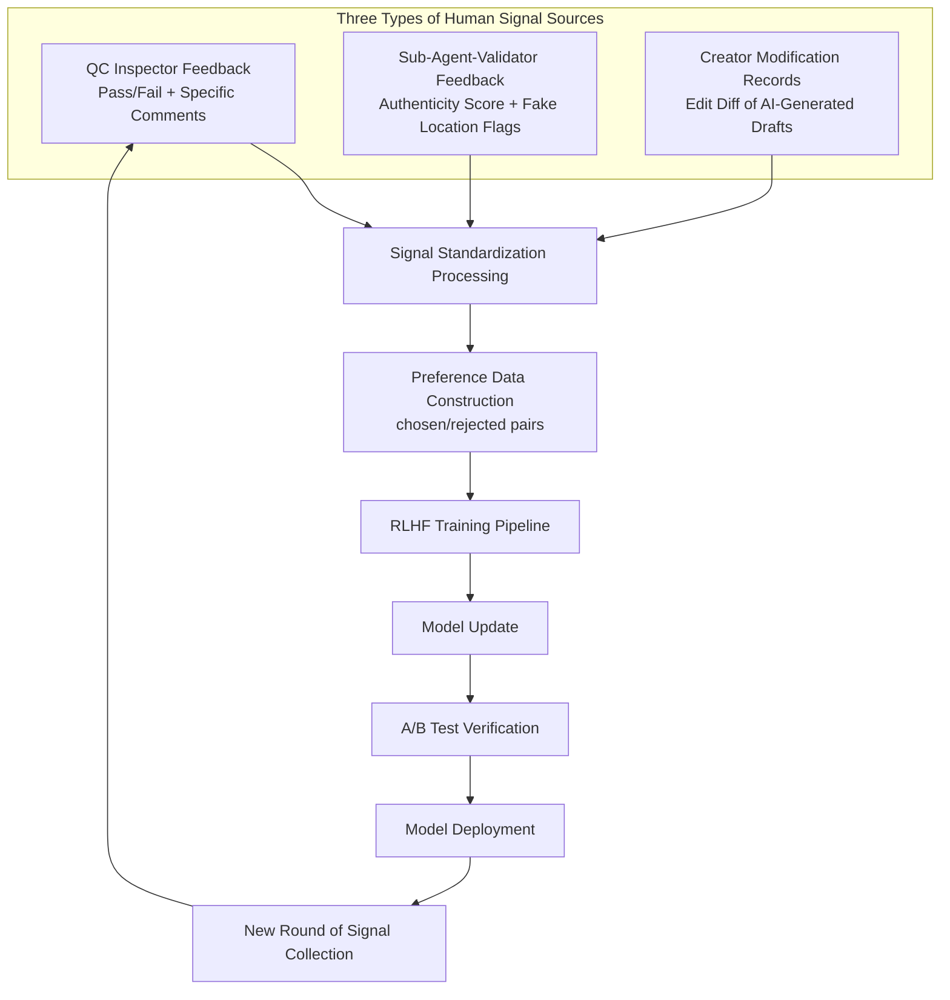

**Detailed Description of Three Human Signal Types:**

| Signal Source | Data Content | Signal Strength | Collection Method |
|---|---|---|---|
| **QC Inspector Feedback** | Pass/fail judgment + failure reasons (image fakeness, text boilerplate, image-text mismatch, etc.) | Strong signal (explicit judgment) | Automatically collected during QC workflow |
| **Sub-Agent-Validator Feedback** | Authenticity score (0-100), substandard element location annotation, revision suggestions | Medium-strong signal (AI evaluation) | Automatically recorded by Agent system |
| **Creator Modification Records** | Diff between AI-generated draft and creator's final submission (text modifications, image replacement/edit records) | Medium signal (implicit preference) | System automatic diff collection |

**RLHF Pipeline Design Highlights:**

1. **Preference Data Construction**
   - QC-passed posts used as chosen, QC-rejected posts used as rejected
   - Creator's pre-edit AI draft used as rejected, post-edit final version used as chosen
   - High-score vs low-score generation results from Validator form preference pairs

2. **Incremental Training**
   - Collect signals in weekly/monthly batches, incrementally train reward model
   - Supports targeted optimization for specific "fakeness" types (human hands, lighting, text boilerplate, etc.)

3. **Effect Evaluation**
   - A/B Test: New model generation vs old model generation, blind-reviewed by QC inspectors
   - Core metrics: QC first-pass rate month-over-month improvement, "AI obvious fake" rate reduction

---

### 10.4 v0.6 — Annotation-Generation Closed-loop Finetune

**Goal**: Connect the data channels between annotation and content generation business lines, utilize high-quality data produced by annotation for closed-loop finetune of base models, and establish a systematic evaluation framework.

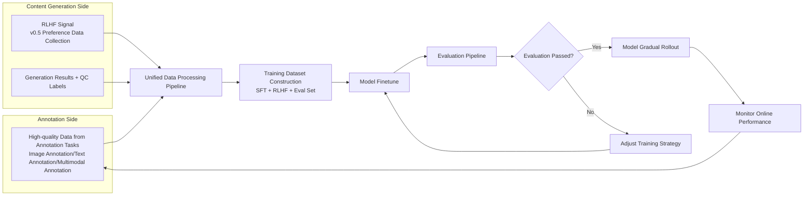

**Core Features:**

| Feature Module | Description |
|---|---|
| **Data Channel** | High-quality annotation data (e.g., image descriptions, multimodal alignment data) from annotation side automatically flows to generation side training set |
| **Training Set Management** | Unified management of SFT datasets, RLHF preference datasets, Evaluation test sets, supporting versioning and traceability |
| **Finetune Pipeline** | Supports LoRA / Full Finetune strategies, integrates training task scheduling and GPU resource management |
| **Evaluation Framework** | Automated evaluation pipeline: multi-dimensional scoring (authenticity/creativity/image-text match) + manual spot checks |
| **Model Version Management** | Model checkpoint version management, supporting gradual rollout and one-click rollback |

**Closed-loop Value**: Annotation data quality improvement → Model finetune effectiveness improvement → Generation quality improvement → More high-quality generation data feeds back into annotation and training, forming a **data flywheel**.

---

## 11. Risks and Mitigation

| Risk | Impact | Mitigation |
|---|---|---|
| AI model generation quality not meeting expectations | Post "obviously AI-generated" rate cannot be effectively reduced | Multi-Agent multi-round verification + RLHF continuous optimization + licensed stock library fallback |
| User migration resistance | Annotators accustomed to old tools, reluctant to switch | Phased gradual rollout + transition period + user training |
| Data security compliance | Incomplete anonymization leading to data leaks | Dual anonymization detection (input+output) + regular audits |
| Third-party API dependency | Model service instability/changes | Multi-model fallback strategy + abstraction adapter layer |
| Uneven RLHF Signal quality | Low-quality signals causing model degradation | Multi-source signal cross-validation + signal quality filtering + A/B test pre-deployment verification |
| Closed-loop data bias | Model increasingly biased toward specific styles | Evaluation test set diversity assurance + regular introduction of external data calibration |

---

## 12. Appendix

### 12.1 Glossary

| Term | Description |
|---|---|
| **Post** | Social media published content, including image/video + text introduction |
| **"AI Obvious Fake"** | Generated content visibly exhibits AI-generated characteristics, obviously not human-created |
| **Human-in-the-Loop** | Introducing human review and modification stages into the AI generation workflow |
| **RLHF** | Reinforcement Learning from Human Feedback |
| **PII** | Personally Identifiable Information |
| **Multi-Agent** | Multi-agent system, multiple AI Agents collaborating to complete complex tasks |
| **Prompt Auto-Finetune** | AI automatically optimizing user-input prompts to improve generation quality |
| **Stock** | Licensed commercial stock libraries (e.g., Shutterstock, Getty Images) |
| **SFT** | Supervised Fine-Tuning |
| **LoRA** | Low-Rank Adaptation, a parameter-efficient finetuning method |
| **Preference Data** | Preference data containing chosen/rejected paired samples, used for RLHF training |
